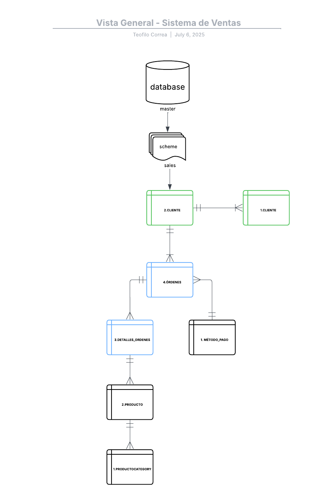

# 🗂️ Diagrama Conceptual

El siguiente diagrama conceptual representa las **entidades clave del sistema de ventas** y sus relaciones principales. Este modelo es una vista de alto nivel que se centra en **comprender el negocio**, sin detallar tipos de datos ni restricciones técnicas.

---

## 📌 Entidades incluidas

- **Cliente:** Representa a las personas o empresas que realizan compras.
- **Producto:** Representa los artículos disponibles para la venta.
- **Categoría de Producto:** Agrupa los productos por tipo o clasificación.
- **Órdenes:** Representa las transacciones de compra realizadas por los clientes.
- **Detalles de Órdenes:** Contiene la información específica de cada producto incluido en una orden.
- **Método de Pago:** Contiene los métodos válidos que los clientes pueden utilizar para realizar sus pagos.

---

## 🔗 Relaciones Clave

- Un **cliente** puede realizar muchas **órdenes**.
- Una **orden** puede contener múltiples **productos** a través de los **detalles de órdenes**.
- Un **producto** pertenece a una única **categoría de producto**.
- Cada **orden** debe tener un **método de pago** válido.

---

Este modelo permite visualizar de manera sencilla **cómo se conectan las principales entidades del sistema**, preparando la base para el modelado lógico y físico posterior.