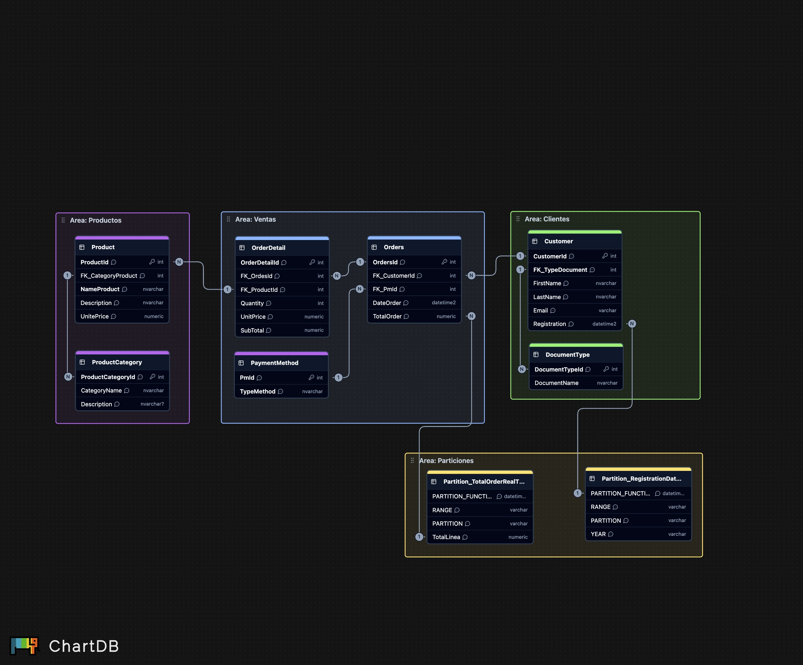

# 📊 Diagrama Lógico

El diagrama lógico del sistema de ventas detalla la **estructura relacional de la base de datos**, incluyendo tablas, claves primarias, claves foráneas y las cardinalidades entre ellas.

Este modelo proporciona una **vista intermedia entre el concepto de negocio y la implementación técnica.**

Aquí se definen las claves, pero no se detallan los tipos de datos específicos ni las restricciones completas (eso se aborda en el modelo físico).

## 🔑 Estructura de las Tablas

- **Customer**
  - `CustomerId` (PK)
  - `DocumentTypeId` (FK)
- **DocumentType**
  - `DocumentTypeId` (PK)
- **Orders**
  - `OrdersId` (PK)
  - `CustomerId` (FK)
  - `PaymentMethodId` (FK)
- **PaymentMethod**
  - `PaymentMethodId` (PK)
- **OrderDetail**
  - `OrderDetailId` (PKC)
  - `OrdersId` (FK)
  - `ProductId` (FK)
- **Product**
  - `ProductId` (PK)
  - `ProductCategoryId` (FK)
- **ProductCategory**
  - `ProductCategoryId` (PK)

## 🔗 Relaciones

- Un **cliente** puede tener muchas órdenes.
- Cada **orden** está asociada a un cliente y a un método de pago.
- Cada **orden** puede tener múltiples detalles.
- Cada **detalle de orden** está asociado a un solo producto y a una orden específica,
formando una clave primaria compuesta **(OrderId + ProductId)**.
- Un **producto** pertenece a una categoría.
- Cada **cliente** tiene asociado un tipo de documento.
